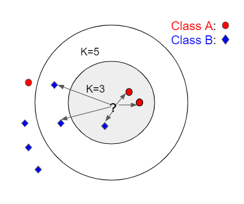



## K- Nearest Neighbour
This is a simplest algorithm which can be used to solve both classification and regression problems depending on the required output.
- In _KNN Classification_,a data point is classified based on its nearest neighbors.
- In _KNN Regression_, average of nearest neighbors is calculated and an ouput value is generated.

Considering KNN classification algorithm for our further analysis below.

In the below diagram, when K =3, it's three closest images are found.
There are 2 points from class A and 1 from class B. Since the most frequent occuring label is 'A', we classify this point as 'A'.
When K=5, based on five closest images and the most frequently occuring label; it is classified as 'B'.
 

Steps used to classify a new point in _KNN Classification_:
 - Find the k nearest neighbors in the training set using a distance metric. The commonly used distance metric is Euclidean distance.
 
   For two vectors $$x, y \in \mathbb{R}^d$$, their Euclidean distance is defined as:
   
   $$\|x - y\| = \sqrt{\sum_{i=1}^d (x_i - y_i)^2}.$$

   We omit the square root, and simply compute _squared Euclidean distance_:
   
   $$\|x - y\|^2 = \sum_{i=1}^d (x_i - y_i)^2.$$

 - Return the most frequently occuring label amongst the k nearest points.
 
How do we set K?
In order to set the K properly, we use Cross Validation technique.

Steps for setting K using Cross Validation:
- Choose K(3,5) randomly. For  each K:
- Split the data into n fold groups. (10 fold groups)
- Each group is considered as  a test/validation set and remaining groups together form the training set. 
- A model is fit on the training set and evaluated on a test set using K-NN classifier.
- For example : when  K=3 , in order to classify a new image; we find it’s three closest images in the training set and then return the most frequently occuring label.
- Find the error estimate. Choose the value of  k that results in the lowest average error rate on these validation sets. That is how we find K in K nearest neighbour classification.

For very high dimensional problems, Dimensionality Reduction is performed before apply KNN Algorithm because Euclidean distance ends up giving equal distances from the vector.
Dimensionality reduction using PCA can prformed as a prior step.

### Project
- Identifying digits using MNIST data set - [KNN_MNIST](https://github.com/pskaranth/thelearningcurve/tree/master/Classification/KNN)

 

