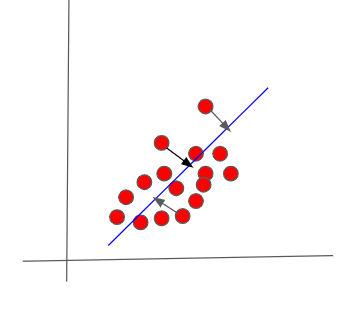


## Principal Component Analysis(PCA)

PCA is the Dimensionality Reduction method that is used to reduce the number of features/dimensions in a high dimensional space and yet retaining the important information.

Benefits of reducing number of features:
- Reduces the amount of storage required.
- Removes noise and irrelevant information.
- It is done to achieve better fitting of the predictive model.

How is it done?
Projecting the high dimensional data to a lower dimensional subspace thereby retaining the points which have higher variance and ignoring the points which have low variance.
Projections which have the largest variance is the first principal component, second largest is the second principal component and so on.

Consider a 2 dimensional data set below with $$x_{1}$$ and $$x_{2}$$ features. The goal is to reduce the dimension from 2D to 1D.
We project points onto the line by finding the closest points on the line. We replace the point by the length of the line(projection).

The 2D points are replaced by the length of line shown in blue. The direction of the line is the direction of the _maximum variance_.

Mathematically this can be explained below.

Projection of x onto unit vector u is given by 
$$x.u = u.x = u^{T}x $$

Variance of  x in the direction u is given by:

$$Var = \frac{\sum_{i=1}^n (x.u)^{2}}{n}$$

In matrix form this is given as: 

$$
\sigma^{2} = \frac{(xu)^{T}(xu)}{n}\\
    = \frac{u^{T}x^{T}xu}{n}\\ 
    = u^{T}\frac{x^{T}x}{n} u\\
    = u^{T} Σ u\\
$$

where  Σ is the covariance matrix $$\frac{x^{T}x}{n} $$ considering mean is zero.

Thus variance given by $$u^{T}Σu$$ should be maximised such that only highest variance is considered.

By introducing a new variable, Lagrange multiplier $$\lambda$$ and adding constraint in the equation ($$uu^{T} = 1 $$) , we get:

$$
L(u,\lambda) = \sigma^{2}- \lambda(u u^{T}-1)\\
\frac{dL}{d\lambda} = u u^{T}-1\\
\frac{dL}{du} = 2 Σ u - 2\lambda u\\
$$

Setting the derivatives to zero for maximising:

$$
u u^{T} = 1\\
M u = \lambda u\\
$$

Desired vector u is an Eigen vector of the covariance matrix M and the maximising vector will be associated with largest Eigen value $$\lambda$$.
Suppose we want to map $$X  \in \mathbb{R}^d$$ to just _k_ dimensions, while capturing as much as variance of X as possible, the best projection is

$$ X ->(u_{1}.x,u_{2}.x,...,u_{k}.x) $$
 
where $$u_{i} are the Eigen vectors
This projections is called the _Principal Component Analysis._

## Reconstruction

Suppose we have to  reduce the dimension from 784 to 100, we pick the first 100 Eigen vectors(U) and project it - which is given by $$U^{T}x$$

This component should be multiplied by U in original dimension to get the reconstructed image in 784 dimension.

## Spectral Decomposition

Suppose M is a symmetric matrix, then M has orthonormal vectors $$ u_{1},u_{2} \in \mathbb{R}^d$$ and corresponding Eigen values $$\lambda_{1}, \lambda_{2}..$$

$$
Mx = U \Lambda U^{T}x
$$

$$U^{T}$$ is a basis change matrix which converts from regular co-ordinate basis to the basis of Eigen vectors.

$$\Lambda$$ is the scaling factor.

Multiplying by U sends it back to the co-oridnate axis.

