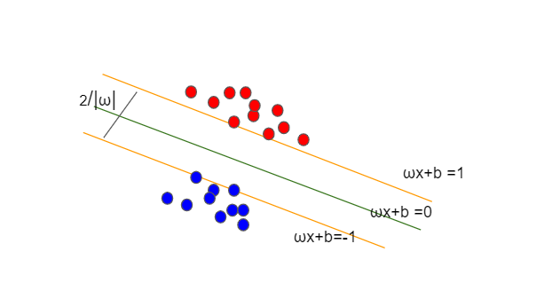
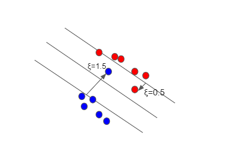



## Support Vector Machines (SVM)

They belong to the category of supervised machine learning algorithms and can be used for Classification and Regression problems.\
Apart from performing linear classification, SVMs can also perform a non-linear classification using the _Kernel trick_  by mapping the inputs to higher dimensional spaces.

Support Vectors constructs a hyperplane to separate data points and the distance between them is called margin.\
These margins are chosen such that the separation of the data is as high as possible.

## Hard Margin SVM

For a linear SVM classifier, we divide the groups of points from y =1 to y =-1 by using a hyperplane that is given by equation of a line in 2-D \
wx + b = 0 \
For Positive samples ; w.x +b >= 1\
For negative samples ; w.x+b <= -1

This can written with one equation as y(w.x+b) >= 1 with y taking values +1 or -1.\
For the points in the margin it is y(w.x+b)-1 = 0 

So we can see that if the points are linearly separable then the hyperplane is able to distinguish between the points and outliers are incorrectly  classified.\
This type of SVM is called as _hard margin SVM_.

Width of margin can be given by $$\frac{2}{ \omega }$$

which means we can minimize $$ \frac{1}{2} \omega ^{2}$$

Also, the goal is to mimimize weights $$\omega = f(\theta)$$ subject to constraints $$[yi(w.xi+b) >= 1] = g(\theta) $$

By using Lagrange multipliers we have,

$$ L = f(\theta) + \sum \alpha_{i} g(\theta) $$

Applying above Lagrange's formulation, we get

$$L = \frac{1}{2}|\omega|^{2} - \sum \alpha_{i}[y_{i}(w.x_{i}+b)-1]$$

Setting the partial derivatives w.r.t $$\omega$$ to 0

$$\frac{\partial L}{\partial \omega} = \omega - \sum \alpha_{i}y_{i}.x_{i} = 0 $$

$$\omega = \sum \alpha_{i}y_{i}.x_{i}$$

$$\frac{\partial L}{\partial b} = \sum \alpha_{i}y_{i} = 0 $$

Lagrange dual problem states that instead of minimizing over w,b subject to constraints involving $$\alpha$$ we can maximise over $$\alpha$$\
subject to relations obtained for w and b.\
This comes from the duality principle which states that optimization problems may be viewed as primal (minimizing over w and b)
or dual (maximising over $$\alpha$$)

For a convex optimization problem, primal and dual have same optimum solution.

Lagrange dual representation then is 

$$L = \frac{1}{2}|\omega|^{2} - \sum \alpha_{i}[y_{i}(w.x_{i}+b)-1]$$

Substituting for $$\omega $$,

$$L = \sum \alpha_{i} -\frac{1}{2} \sum_i\sum_j \alpha_{i} \alpha_{j}y_{i}y_{j} x_{i}.x_{j}$$

where  $$\alpha \geq 0$$

We get $$\alpha$$ from the above equation and we use that to find $$\omega$$ in the equation 

$$\omega = \sum \alpha_{i}y_{i}.x_{i}$$

According to KKT condition,

$$\alpha_{i}(y_{i}(w.x_{i}+b)-1) = 0$$
 
We therefore either have our Lagrange multiplier $$\alpha_{i}$$ equal to zero or non-zero and since for the points on the margin  y(w.x+b)-1 = 0, $$\alpha > 0 $$. 

These points with $$\alpha > 0 $$ are called support vectors.

## SVM for Non linearly separable points

We have,

$$L = \sum \alpha_{i} -\frac{1}{2} \sum_i\sum_j \alpha_{i} \alpha_{j}y_{i}y_{j} x_{i}.x_{j}$$

To solve for $$\alpha $$, all we need is the function k which provides with the dot product of two vectors  $$ x_{i}.x_{j} $$ in other space.\
Inputs are mapped to a higher dimension so that the data can be separated. This is called a polynomial kernel.\
Calculating the higher dimensional relationship without transforming the data into higher dimension is the Kernel trick.\
SVM uses this kernel trick to separate non linearly separable data points.

## Soft Margin SVM

In case of soft margin SVM, we add a slack variable ( ξ )  to be able to classify in spite of outliers.\
This can be given by y(w.x+b) >= 1 - ξ\
In this case we are trying to minimize $$|\omega|^{2}+C \sum_{i=1}^nξ $$

 
We're trying to minimize the length of $$\omega$$, because we want a large margin. And we're also trying to minimize the total amount of slack, that is  the sum of the ξ.\
This is because we don't want too many constraints to be violated. There are two things that is being minimized. There will be eventually a tradeoff between these two things. \
So C is a constant that manages that tradeoff and it has to be set appropriately.

Dual form of soft margin SVM is very similar to hard margin:

$$L = \sum \alpha_{i} -\frac{1}{2} \sum_i\sum_j \alpha_{i} \alpha_{j}y_{i}y_{j} x_{i}.x_{j}$$

and $$\alpha $$ is between 0 and C. 

References :
Patrick Winston's lecture on <a href="https://www.youtube.com/watch?t=1020&v=_PwhiWxHK8o&feature=youtu.be">youtube</a>

