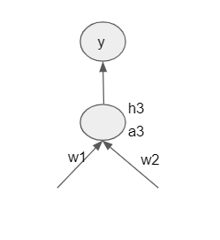
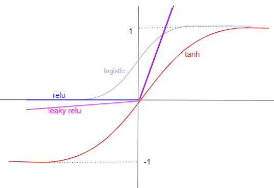



## Activation and Initialization

The Logistic function contains an exponential term as it can be seen from the function definition. The sigmoid function has a high computational cost as it is exponential. 

$$ y = \frac{1}{1+ e^{-x} $$

It's gradient can be calculated using the formula 

 $$f'(x) = f(x)(1 − f(x))$$

When the logistic function reaches either a maximum(1) or minimum value(0); the derivative f'(x) will be 0. The function is saturated at this point.
And since one of the neuron is saturated(derivative=0), the gradient($$\Delta \omega $$) will be 0 and the weight will not get updated. Saturated neurons can thus cause _gradients to vanish_.

A zero-centered function will have the output less than 0 and sometimes greater than 0. The sigmoid function takes value value between 0 and 1. Hence it always produces a non-negative value as output. Thus it is not a zero-centered activation function.

								
$$\Delta \omega_{1} = $$\frac{\partial L(\omega)}{\partial y}. \frac{\partial y}{\partial h3}. \frac {\partial h3}{\partial a3}. \frac {\partial a3}{\partial \omega_{1}} $$

$$\Delta \omega_{2} = $$\frac{\partial L(\omega)}{\partial y}. \frac{\partial y}{\partial h3}. \frac {\partial h3}{\partial a3}. \frac {\partial a3}{\partial \omega_{2}} $$

Since $$ a3 =  \omega_{1} h_{21} + \omega_{2} h_{22} $$ 
So $$ \frac {\partial a3}{\partial \omega_{1}} $$ \frac {\partial a3}{\partial \omega_{2}} $$ would be h21 and h22 , which are output of logistic functions and hence cannot be less than 0. 
Thus gradients w.r.t all the weights ($$\Delta \omega_{1}$$, $$Delta \omega_{2}$$) connected to the same neuron are either all positive or all negative. This means that gradients can only move in a certain direction and hence takes very long time to converge. This is the disadvantage of the logistic function being a non-zero centered function.

## Tanh 

To have the benefits of the logistic function along with zero-centered nature tanh was introduced. It is a non-linear activation function that clips outputs between [-1,1]
$$ f(x) = \frac{ e^{x}-e{-x}}{e^{x}+e^{-x}}$$
$$ f'(x) = (1-f(x)^{2})

Tanh saturates at maximum/minimum values and hence has vanishing gradients problem just like logistic function. Gradients are not restricted to move in certain directions as they are zero centered. They are still computationally intensive because of exponential values.

## ReLu

ReLU  clips negative values to zero while keeping positve values same as before. It is not a zero-centered function. 
$$ f(x) = max (0,x) $$ \
f'(x)= $$\begin{cases}
		0 \hspace{1cm} if x<0 \\
		1 \hspace{1cm} if x>0\\
		\end{cases}
$$

Consider, 
$$h_{1} = Relu(a_{1})$$ = max(0,a_{1})$$\
$$h1= max(0,\omega_{1} x_{1}+\omega_{2}x_{2}+b)$$\
If b takes on a highly negative value, then h1->0 , $$\frac{\partial h1}{\partial a1}->0 $$ \
This causes $$\omega_{1}$$ , $$\omega_{2}$$ and b to have no updates causing a _Dead Neuron_

It does not saturate in the positive region, hence avoids vanishing gradient problem. It is computationally faster and converges earlier than logistic or tanh.

## LeakyRelu

This is a variant of Relu. Leaky ReLU maps larger negative values to smaller ones by reducing the slope of the mapping function.

$$ f(x) = max (0.01x,x) $$

f'(x)= $$\begin{cases}
		0.01 \hspace{1cm} if x<0 \\
		1 \hspace{1cm} if x>0\\
		\end{cases}
$$
Value 0.01 does not let the derivative to be 0. It does not saturate in positive or negative region. It is zero-centered and easy to compute.

## Why do we need non-linear activation functions in the network?

As we have seen in our example we have,  \
* _a_: It is a weighted sum of inputs plus the bias. This is given by wx+b.\
* _h_: This is the activation function which introduces non-linearity.  $$ h = \sigma(a)$$

Instead of applying the non-linear activation function(h),if we apply just the linear transformation to the output of pre-activation; the output we get is just a product of all weights.
$$ y = W_{2}(W_{1}x_{i}) $$
$$y = Wx_{i} $$

We will end up learning up y as just a linear transformation of x. The whole idea of representational power of a deep neural network, to learn the complex non-linear relationship between the input and the output will not be achieved. Thus we will not be a ble to learn any non-linear decision boundaries.

## Weight Initialization

While initializing weights :
* Weights connected to same neurons should not be initialized to same value.
* Initializing weights to very small or very high could cause gradients to vanish.
* Inputs should always be normalized so that higher values could again interfere with weight updates.

## Xavier initialization

If the number of neurons are more, then choosing a less value for weights will compensate for the higher value of neurons. Same with choosing a higher value of weights when there are less neurons. This is the idea behind _Xavier Initialization_.

$$ W \propto \frac{1}{n}$$

Value of weights chosen are inversely proportional to the number of neurons in the previous layer. Xavier initialization is used in tanh and logistic functions.

## He initialization

In He initialization, the value of weights are inversely proportional to the square root of number of neurons in previous layer divided by 2.
This is used in case of RelU and leaky RelU as half of the neurons in the negative region does not exist.

$$ W  \propto \frac{1}{sqrt(n/2)}$$

References:\
* DeepLearning - Padhai OneFourthLabs
