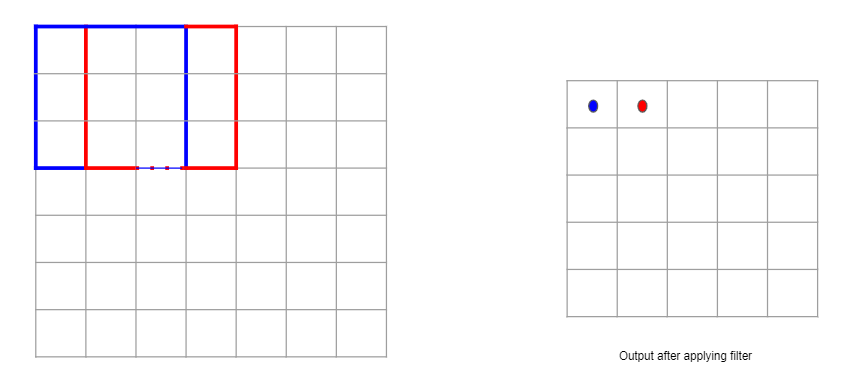
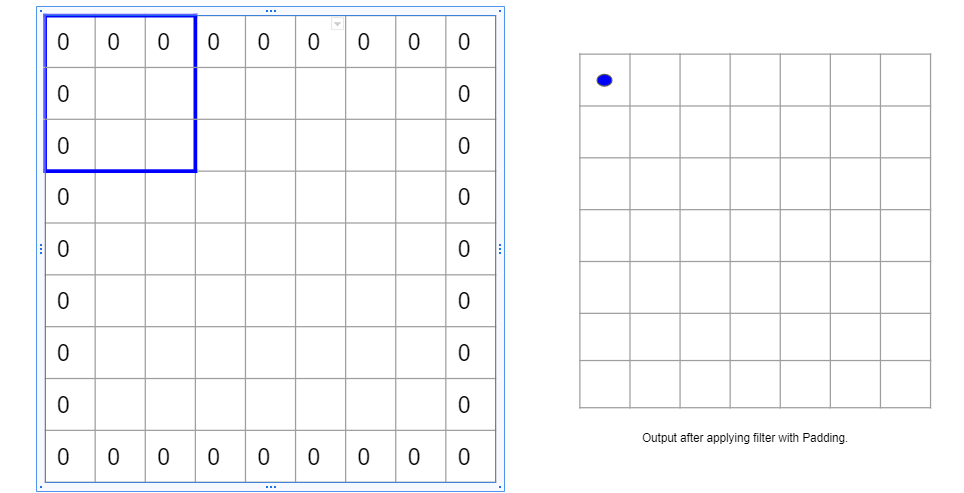
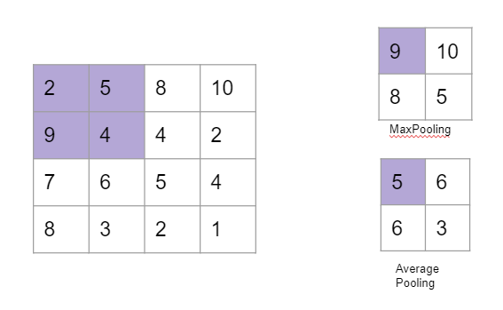
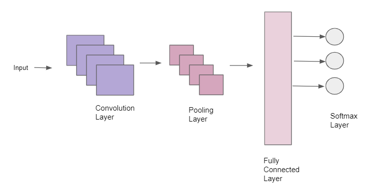



## Convolution Neural Networks (CNN)

Disadvantage of just using the feedforward neural network for a complex image is that the network is prone to overfitting due to the presence of many parameters.\
The goal of CNN is to reduce the image to a form which is easier to process and not losing important features at the same time. 

CNN uses Kernel/Filter as it's first layer. Kernels are small matrix and can be used for edge detection, blurring or sharpening the image.\
An image is passed through a Kernel. Each pixel is placed at the center of the kernel and the value of that pixel is re-computed as the weighted sum of its neighbours.

For getting a blur image as an output, the original image is passed through a 3x3 identity kernel matrix. 

The size of the output returned is smaller than the input. If the size of the output should be same as the input a layer of padding is added. These are extra layer of zeros around. This is called Padding.

Stride (S) defines the interval at which the filter is applied. Higher the stride smaller is the output.

$$W_{o} = \frac {W_{I} - F +2P}{S}+1 $$

$$W_{o}$$ is the output width \
$$W_{I}$$ is the input width \
F is the filter , P is the padding and S is the Stride

Activation functions are commonly used by CNNs. Some of the activation function are listed below: 

--Sigmoid/logistic function clips the input into an interval between 0 and 1.
--tanh lies between -1 and 1\
--ReLU clips negative values to zero while keeping positve values same as before.\
--Leaky ReLU maps larger negative values to smaller ones by reducing the slope of the mapping function.

Usually, non-linear activation function ReLU is applied in the convolution layer. This makes up for the linearity the convoluted layer imposes on the network. 

## Pooling Layer

The Pooling layer is responsible for reducing the size of the features. Pooling operation reduces the computational power required to process the data.\
There are two kinds of pooling that can be done :

--Max Pooling returns the maximum value from the portion of the image covered by the Kernel.\
--Average Pooling returns the average of all the values from the portion of the image covered by the Kernel.

Multiple layers of filters and pooling layers of different sizes can be stacked before passing it to fully connected layer.

## Fully connected layer

Finally we have  _Fully Connected layers_ (Feed-Forward Neural Network) with varying number of hidden layers. Output of this layer is passed through softmax layer. Softmax layer outputs probability distribution which helps to classify images.

CNN will have all 3 layers :
* Convolution layers with Kernels (with non linear activation function rel-u)
* Maxpooling layers 
* Fully connected layers

Benefits of CNN is that it allows sparse connectivity and weight sharing. It hence require less parameters.\
The weights used in CNN are in such a way that it predicts the next value giving more weightage to most recent value and less importance to the historical value. If equal weightage is given all the values then it becomes the average of all the values.

Instead of choosing parameters such as number of filters, filter size and number of layers; we could use standard architecture available such as AlexNet, GoogleNet, ResNet,..

