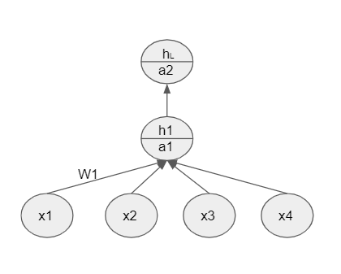
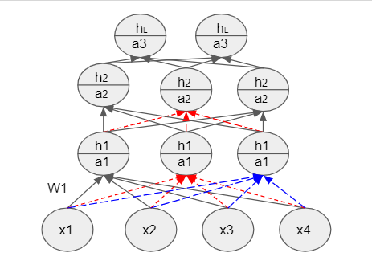



## Feedforward Neural Networks

These network of models are called feedforward because the information moves forward from the input nodes to the hidden layers and then to the output nodes.

Even though a single layer of Sigmoid Neuron can be used only for linearly separable data, many such layers can be used to approximate the relationship between the complex input and the output; thus can be used for non-linear data too. This is the Univeral Approximation theorem.

In feedforward neural networks the layers between the input and the output are called hidden layers. These hidden layers are used to formulate the non-linear relationship between the complex input and the output.

Structure of a neuron :

a is Pre-activation function is the weighted sum of inputs and can be given by :

$$ a_{i} = W_{i}h_{i-1}(x) + b_{i}$$

h is the activation function which is given by the sigmoid function

$$ h_{i}  = \frac{1}{e^{-a_{i}}} $$

We get the final output by applying the softmax function:

$$\hat{y_{i}} = \frac{e^{a_{1}}}{\sum_{j=1}^k e^{a_{j}}}$$

The predicted output is the probability distribution $$\hat{y_{i}}$$ which can be compared with the true probability distribution y. This loss measure is the cross entropy and is given by :

$$L(\theta) = -\sum_{i=1}^k y_{i} log(\hat{y_{i}}) $$

Multiple stacking of the above neuron and several such layers of neuron forms the _Deep Neural Network_. The output of one layer becomes the input of the next layer.\
The error at the final layer is computed and fed back to the network. Several learning algorithms are used to get the error minimized. One such learning method is the Backpropogation.\
Optimum values of w and b are calculated using the optimization method called gradient descent algorithm. In here, we compute the derivative of the loss function w.r.t weights.

## Backpropogation

$$ a_{11} = \omega_{111}x_{1} + \omega_{112}x_{2} + b_{11}$$

We have to find $$\omega$$ and b such that loss is minimized. 

$$ (\omega_{222})_{t+1} = (\omega_{222})- \eta \Delta (\omega_{222})_{t}$$

We use _Backpropogation Algorithm_ for computing the loss function w.r.t $$\omega$$ i.e $$\Delta (\omega_{222})_{t}$$. 

$$\begin{aligned}

\Delta \omega_{222} = \frac{\partial L}{\partial \omega_{222}} &= \frac{\partial L}{\partial a_{22}}. \frac{\partial a_{22}}{\partial \omega_{222}}\\
							&= \frac{\partial L}{\partial h_{22}}. \frac{\partial h_{22}}{\partial a_{222}}.\frac{\partial a_{22}}{\partial \omega_{222}}\\
							&= \frac{\partial L}{\partial a_{31}}.\frac{\partial a_{31}}{\partial h_{22}} \frac{\partial h_{22}}{\partial a_{22}}.\frac{\partial a_{22}}{\partial \omega_{222}}\\
							&= \frac{\partial L}{\partial \hat{y_{i}}}.\frac{\partial \hat{y_{i}}}{\partial a_{31}}. \frac{\partial a_{31}}{\partial h_{22}} \frac{\partial h_{22}}{\partial a_{22}}.\frac{\partial a_{22}}{\partial \omega_{222}}\\
							
\end{aligned}
$$

We can compute the derivative wrt any variable by using the _chain rule_. Intuitively, this means that we are going backwards and computing the error.
