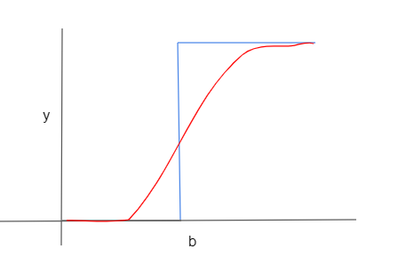



## MP Neuron
It is an early model of artificial neuron by McCulloch and Pitts.

Inputs(x) belong to the discrete set of values {0,1}\
g(x) aggregates the inputs and function f(x) is the decision based on these aggregations.

$$ y = g(x) = \sum_{i=1}^{n} x_{i}$$

$$
\begin{cases}
y = 1 \hspace{1cm} if \hspace{1cm} \sum_{i=1}^{n} x_{i} \geq b \\
y = 0 \hspace{1cm}  otherwise
\end{cases}
$$

b is the threshold parameter and is adjsuted with the goal of maximising the correct number of correct predictions.

This algorithm takes only boolean inputs as parameters and if  data has non-boolean inputs, it is converted to a boolean form.

Loss is given by $$ \sum_{i} (\hat{y_{i}} - y_{i})^{2}$$\
$$\hat{y_{i}}$$ is the predicted value, \
$$y_{i} $$ is the actual value
	
Geometric interpretation \
$$\hat{y_{i}} =  \sum_{i=1}^{n} x_{i} \geq b $$ in 2D can be rewritten as

x1 + x2 - b >= 0 (decision boundary)

Positive predictions yield a value(1) x1 + x2 - b >= 0 and lie above the decision boundary.\
Positive predictions yield a value(0) x1 + x2 - b < 0 and lie below the decision boundary.

It works with boolean inputs and linearly seaprable data.

## Perceptron

Each parameter $$x_{i}$$ has different effect on the output, some more and some less. To account for these, we include weights along with the inputs.

$$g(x) = \sum_{i=1}^{n}\omega_{i} x_{i}$$

$$\begin{cases}
y = 1 \hspace{1cm} if \hspace{1cm} \sum_{i=1}^{n} \omega_{i} x_{i} \geq b \\
y = 0 \hspace{1cm} otherwise
\end {cases}
$$

Geometric interpretation \
$$\hat{y_{i}} =  \sum_{i=1}^{n} \omega_{i} x_{i} \geq b $$ in 2D can be rewritten as

$$\omega_{1} x_{1} + \omega_{2} x_{2} - b >= 0 $$ (decision boundary)

Positive predictions yield a value(1) wx1 + wx2 - b >= 0 and lie above the decision boundary.\
Positive predictions yield a value(0) wx1 + wx2 - b < 0 and lie below the decision boundary.

Learning Algorithm:

We have, 

$$W = [\omega_{1}, \omega_{2}, … \omega_{n}]$$

$$X = [x1, x2, … xn]$$

$$Cos \theta = \frac{\omega.x}{||\omega||x||}$$

As 𝜃 ranges from 0 to 180, cos 𝜃 ranges from 1 to -1

The denominator is always positive.Therefore

$$Cos \theta  ∝  w.x $$

From above, for positive points $$\omega.x > 0 $$ ,

So if  $$\omega.x < 0$$, we adjust $$\omega$$ such that $$\omega_{new} = \omega+x $$

It means that angle between them is greater than 90, but we want it to be less than 90 (because they belong to positive points). Performing this operation will get the new angle between $$\omega$$ and x decreased.

Putting everything together, learning algorithm can be given by:

<i>
while !convergence do   
 if x ϵ P and w.x < 0    
   w = w + x    
 if x ϵ N and w.x > 0    
   w = w - x  
</i>

## Sigmoid Neuron 

They are very similar to Perceptron model but are modified in a way such that the output is much smoother than the harsh decision boundary from perceptron.\
A small change in the input only causes small change in the output. Most commonly used function is logistic function which has a S shaped curve as below.

The function is given by:

$$ y = \frac{1}{e^{-\omega x+b}} $$

Output is a real value between 0 and 1. The optimum value of w and b are chosen such that squared error loss is miminized.

Using Mean square error loss, we can find $$\omega $$ and b such that the loss is minimized:

$$ minimize  L(\omega,b) = \sum_{i=1}^nmin||y_{i}-f(x_{i})||^{2} $$

Sigmoid neuron is a good attempt at creating a decision boundary that works well for non-linearly separable data by smoothening the decision boundary. But it is not very effective in separating the data. Several such sigmoid layers are used to achieve the non-linearity.

