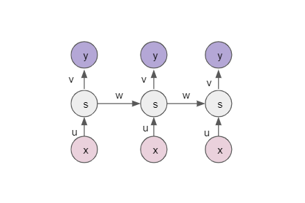
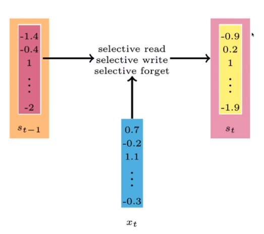
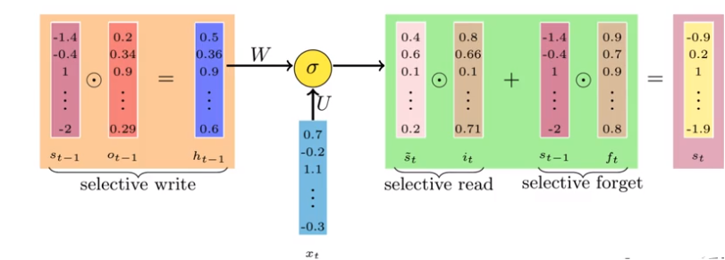



## Recurrent Neural Networks

RNN is recurrent as it evaluates the same function for the input at each layer. Subsequent outputs not only depends on the current input but also on the previous inputs.

It can be used in Sequence modelling where the task is to predict the next word. This is done by computing the probability of the occurence of the words in the sequence by taking into account the current and the previous word.

The inputs are denoted by $$x_{i}$$\
The weights associated with input x is denoted by U\
The weights from the previous output is denoted by W\
The output at each layer is $$y_{i}$$\
s is the state vector which is computed as a function of the output of the previous output and current input with bias.

If the task is Sequence Classification (For example: sentiment analysis), then the output $$\hat{y}$$  is computed for the entire sequence.

$$s_{i} = \sigma(Ux_{i} + Ws_{i-1}+b)$$, s is the state vector\
$$\hat{y} = O(Vs_{T} +c)$$ , T accounts for entire length of the inputs.

If the task is Sequence labeling (For example: part of speech tagging), then the output is predicted at each layer.

$$s_{i} = \sigma(Ux_{i} + Ws_{i-1}+b)$$\
$$\hat{y} = O(Vs_{i} +c)$$

Depending on the learning problem the output y can be computed for the entire sequence or at each and every layer.

The state vector (s) is of fixed size and at every step the information is computed. If a very long sequence is considered, the first input gets morphed into something else and it is difficult to know it's contribution to the state vector by the time it reaches the end of sequence. Also when training RNN using back-propogation, gradients either vanish or explode.

So the goal is to selectively read, write and forget inputs we won't need so that the finite size for RNN can be maintained.

Using an analogy of sentiment analysis, we could say that we want to :
* Selectively forget the stop words.
* Selectively read the information added by previous sentiment bearing words.
* Selectively write the new information from the current word to the new state.

## Long Short Term Memory networks (LSTM) 
In order to acheive the goal of selectively read, write and forget; we use LSTM. It composes of 3 gates: input, output and forget gates which controls the flow of data.

#### 1. Selectively write 
We have at every time step ,\
$$s_{i} = \sigma(Ux_{t} + Ws_{t-1}+b)$$

Instead of passing $$s_{t-1}$$ as it is to $$s_{t}$$ , only pass certain fraction of the previous state to the current state.

An intermediate layer $$h_{t-1}$$ is computed based on $$s_{t-1}$$ and $$o_{t-1}$$ 

$$o_{t-1}$$ is the output gate and has the value between 0 and 1 suggesting the importance. This is learnt based on the parameters in the network.

$$o_{t-1} = \sigma(U_{o}x_{t-1} + W_{o}h_{t-2}+b_{o})$$

$$ h_{t-1} = s_{t-1} \odot o_{t-1}$$

Using $$h_{t-1}$$ and and the input of the current layer $$x_{t}$$ we compute an intermediate layer $$\tilde{s_{t}}$$ .

$$\tilde{s_{t}} = \sigma W (h_{t-1} + U x_{t} + b )$$

#### 2. Selectively read
We have an input gate $$i_{t}$$ which performs operation with $$\tilde{s_{t}}$$ to selectively read required inputs.
 
$$i_{t} = \sigma(U_{i}x_{t} + W_{i}h_{t-1}+b_{i})$$

#### 3. Selectively forget
$$f_{t}$$ is called the forget gate , This again decides what fraction of $$s_{t-1}$$ should be retained in computing $$s_{t}$$

$$f_{t} = \sigma(U_{f}x_{t} + W_{f}h_{t-1}+b_{f})$$

Combining input and the forget gates, we compute the final $$s_{t}$$

$$s_{t}= \tilde{s_{t}} \odot i_{t} + s_{t-1} \odot f_{t}  $$

Selective write is performed again,

$$ h_{t} = o_{t} \odot \sigma(s_{t})$$

Final output is obtained as below:

$$ \hat{y} = O(Vh_{t}+c) $$

LSTM has many variants which include different number of gates, one such variant is Gated Recurrent Unit (GRU).\
GRU, it is similar to LSTM seen above in structure but without a forget gate and hence requires less number of parameters as compared to normal LSTM.\
Gates:\
$$o_{t} = \sigma(U_{o}x_{t} + W_{o}s_{t-1} + b_{o})$$\
$$i_{t} = \sigma(U_{i}x_{t} + W_{i}s_{t-1} + b_{i})$$

States:\
$$\tilde{s_{t}} = \sigma (W (o_{t} \odot s_{t-1}) + U x_{t} + b )$$\
$$s_{t}= (1-i_{t}) \odot s_{t-1} + i_{t} \odot \tilde{s_{t}} $$ 

LSTM is well developed to deal with vanishing gradient problem. It allows gradients to flow unchanged, but can suffer from exploding gradients.

References:
* DeepLearning - Padhai OneFourthLabs
