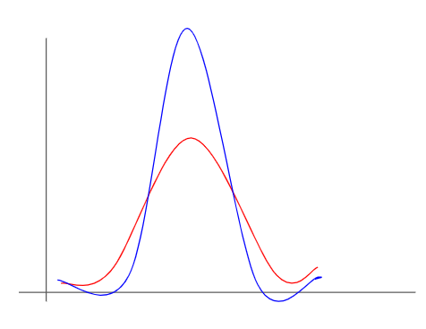
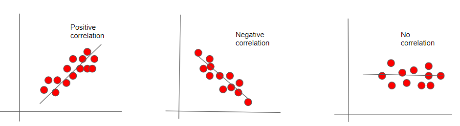


## Expectation
The expected value is the _average_ of all values that a discrete random variable X can have. It is also the mean of all the values of X and is denoted by _E(X)_.

Let X be a variable with values $$x_{1},x_{2},...$$ with each of it's probabilities $$p_{i}$$.

Then Expectation of variable is given by $$E(X) = \sum_{i=1}^n(P(i).x_{i})$$

## Variance
It is the measure of the spread of the data around it’s mean value. 

Variance is measured by considering the deviation of the random variable X from it's expected value.
Absolute difference can then be given by : $$E(|X-E(X)|)$$ ; Since this is hard to differentiate, this term is squared.
Hence, the variance of a random variable X, with mean $$E(X)=μ_{x}$$
can be given by

$$Var(X)=E[(X−μ_{x})^{2}]$$

Larger the variance, the distribution of data is higher.

The data points denoted by red has higher variance than the one denoted by blue as the data is more spread around the mean.

## Standard Deviation
It is a measure of how far the data is spread. It is measured by the squared root of Variance and denoted by $$\sigma_{x}$$

## Covariance
It gives the relationship between two variables X and Y. It tells us how the data is spread relative to each other.

The covariance between X and Y is defined as:

$$
\begin{aligned}
Cov(X,Y)=E[(X−E(X))(Y−E(Y))]=E[(X−μ_{x})(Y−μ_{y})]
        =E[XY]−(E(X))(E(Y))=E[XY]−μ_{x}μ_{y}   
\end{aligned}
$$

If they are centered around the mean, then second component is zero. Covariance in this case is given by:
$$Cov(X,Y) = E(XY)$$

By normalising the covariance, we get Correlation Coefficient given by :

Pearson’s coeff $$ρ(x,y)= \frac{Cov(X,Y)}{\sigma_{x}\sigma_{y}}$$

Positive correlation occurs when variables move in the same direction; if one variable increases the other variable also increases.

When one variable increases and the other decreases, then there is negative correlation.

## Covariance matrix 
It is a square matrix  indicating the covariance between each pair of elements of vector. Diagonal elements consist of variances, and off diagonal elements will have covariances.
The covariance matrix is symmetric and positive semi definite.

Covariance matrix denoted by Σ is defined by:
$$Cov(X)=E(XX^{T})−μμ^{T}$$ 

If mean is zero,then: 
$$Cov(X)=XX^{T}/n$$

$$
\begin{aligned}
& Cov(X) = \left( \begin{array}{cc}
             \Sigma_{11} & \Sigma_{12} \\
             \Sigma_{21} & \Sigma_{22}
              \end{array} \right)
              \end{aligned}$$
              
where $$\Sigma_{ii}$$ indicates variance and $$\Sigma_{ij}$$ indicates covariance.

